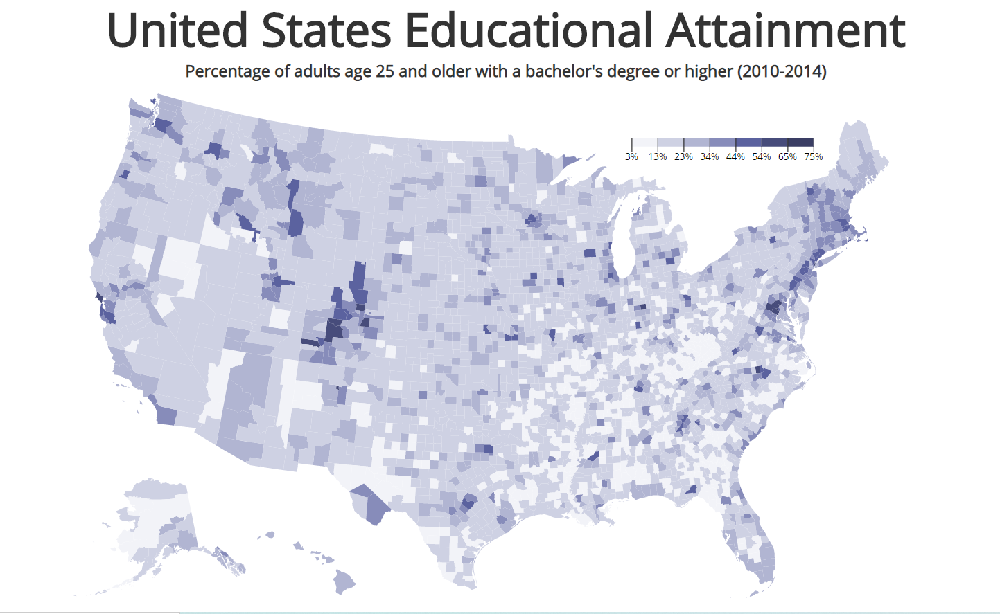

# Visualize United States Educational Attainment - D3

## Description
Visualization of United States educational attainment. The aim of this project is to be better acquainted with the D3.js library.

## Setup
- `npm start` to start server and move over to `port 3000`.